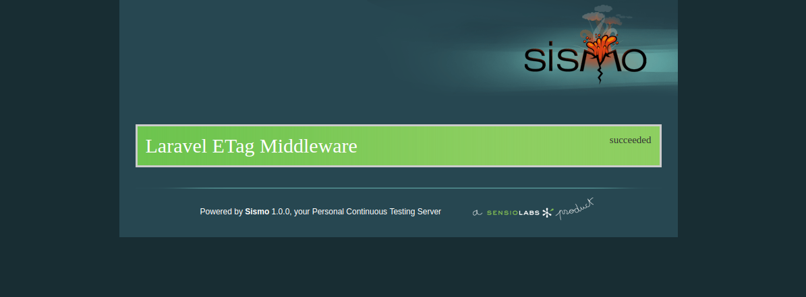
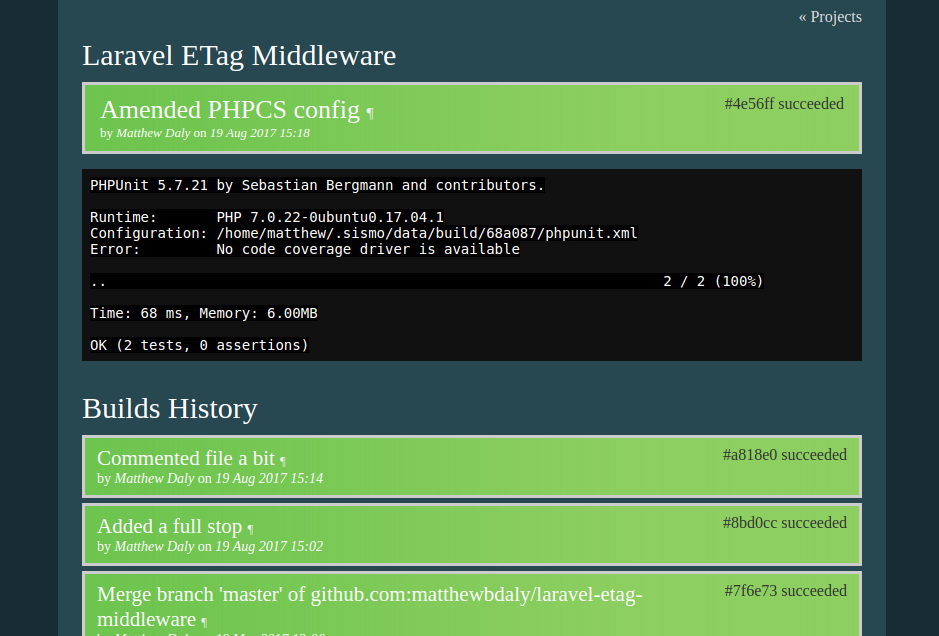

Continuous integration is a veritable boon when working on any large software project. However, the popularity of distributed version control systems like Git over the older, more centralised ones like Subversion means that when you commit your changes, they don't necessarily get pushed up to a remote repository immediately. While this is a good thing because it means you can commit at any stage without worrying about pushing up changes that break everyone else's build, it has the downside that the tests aren't automatically run on every commit, just every push, so if you get sloppy about running your tests before every commit you can more easily get caught out. In addition, a full CI server like Jenkins is a rather large piece of software that you don't really want to run locally if you can help it, and has a lot of functionality you don't need.

[Sismo](https://sismo.symfony.com/) is a small, simple continuous integration server, implemented in PHP, that's ideal for running locally. You can set it up to run your tests on every commit, and it has an easy-to-use web interface. Although it's a PHP application, there's no reason why you couldn't use it to run tests for projects in other languages, and because it's focused solely on running your test suite without many of the other features of more advanced CI solutions, it's a good fit for local use. Here I'll show you how I use it.

Setting up Sismo
----------------

Nowadays I don't generally install a web server on a computer directly, preferring to use Vagrant or the dev server as appropriate, so Sismo generally doesn't have to coexist with anything else. I normally install PHP7's FastCGI implementation and Nginx, along with the SQLite bindings (which Sismo needs):

```bash
$ sudo apt-get install nginx php7.0-fpm php7.0-sqlite3
```

Then we can set up our Nginx config at `/etc/nginx/sites-available/default`:

```nginx
server {
    listen 80 default_server;
    listen [::]:80 default_server ipv6only=on;
    fastcgi_param HTTP_PROXY "";

    access_log /var/log/nginx/access.log;
    error_log /var/log/nginx/error.log;

    root /var/www/html;
    index sismo.php index.html index.htm;

    server_name server_domain_or_IP;

    location / {
        try_files $uri $uri/ /sismo.php?$query_string;
    }

    location ~ \.php$ {
        try_files $uri /sismo.php =404;
        fastcgi_split_path_info ^(.+\.php)(/.+)$;
        fastcgi_pass unix:/var/run/php/php7.0-fpm.sock;
        fastcgi_index sismo.php;
        fastcgi_param SCRIPT_FILENAME $document_root$fastcgi_script_name;
        fastcgi_param SISMO_DATA_PATH "/home/matthew/.sismo/data";
        fastcgi_param SISMO_CONFIG_PATH "/home/matthew/.sismo/config.php";
        include fastcgi_params;
    }
}
```

You'll probably want to adjust the paths as appropriate. Then set up the required folders:

```bash
$ mkdir ~/.sismo
$ mkdir ~/.sismo/data
$ touch ~/.sismo/config.php
$ chmod -R a+w ~/.sismo/
```

Then, [download Sismo](https://sismo.symfony.com/get/sismo.php) and put it in your web root (here it's at `/var/www/html/sismo.php`).

Now, say you have a project you want to test (I'm using my [Laravel ETag middleware](https://github.com/matthewbdaly/laravel-etag-middleware) for this example). We need to specify the projects we want to test in `~/.sismo/config.php`:

```php
<?php

$projects = array();

$notifier = new Sismo\Notifier\DBusNotifier();

Sismo\Project::setDefaultCommand('if [ -f composer.json ]; then composer install; fi && vendor/bin/phpunit');

$projects[] = new Sismo\GithubProject('Laravel ETag Middleware', '/home/matthew/Projects/laravel-etag-middleware', $notifier);

return $projects;
```

Hopefully this shouldn't be too difficult to understand. We create an array of projects, then specify a notifier (this is Linux-specific - refer to the documentation for using Growl on Mac OS). Next, we specify that by default the tests should run `composer install` followed by `vendor/bin/phpunit`. We then specify this project is a Github project - it also supports Bitbucket, or plain SSH, or the default Project, but in general it shouldn't be a problem to use it with any repository as you can just run it against the local copy. Finally we return the list of projects.

Now, we should be able to run our tests as follows:

```bash
$ php /var/www/html/sismo.php build
Building Project "Laravel ETag Middleware" (into "68a087")
```

That should be working, but it doesn't get us anything we don't get by running the tests ourselves. To trigger the build, we need to set up a post-commit hook for our project in `.git/hooks/post-commit`:

```bash
#!/bin/sh

php /var/www/html/sismo.php --quiet --force build laravel-etag-middleware `git log -1 HEAD --pretty="%H"` &>/dev/null &
```

You should now be able to view your project in the Sismo web interface at [http://localhost](http://localhost):



Clicking on the project should take you through to its build history:



From here on, it should be straightforward to add new projects as and when necessary. Because you can change the command on a per-project basis, you can quite happily use it to run tests for Python or Node.js projects as well as PHP ones, and it's not hard to configure it.

I personally find it very useful to have something in place to run my tests on every commit like this, and while you could just use a post-commit hook for that, this approach is less obtrusive because it doesn't force you to wait around for your test suite to finish.
